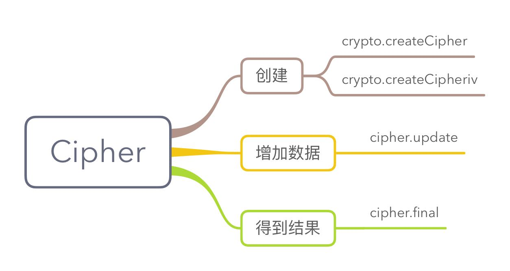

# 加密解密

在 Node.js 中，使用 `crypto` 模块来实现数据的加密和解密处理。

## crypto 模块概述

在 Node.js 中，使用 OpenSSL 类库作为其内部实现加密与解密处理的基础手段，封装在 `crypto` 模块中。

crypto 模块中包含了类似 MD5 或 SH-2 之类的散列算法。开发者也可以通过 crypto 模块来实现 HMAC 运算。

> HMAC（Hash-based Message Authentication Code，散列运算消息认证码）运算利用散列算法，以一个密钥和一个消息为输入，生成一个消息摘要作为输出。HMAC 运算可以用来验证两段数据是否匹配，以确认该数据没有被篡改。

在 crypto 模块中，为每种加密算法定义了一个类。可以使用 `getCiphers` 方法来查看 Node.js 中能够使用的所有加密算法。使用方法如下：

```js
crypto.getCiphers()
/**
* [ 'aes-128-cbc', 'aes-128-cbc-hmac-sha1', .... ] 
* 共 119 个数组元素，Node.js v8.0.0
*/
```

可以使用 `getHashes` 方法来查看所有散列算法。用法如下：

```js
crypto.getHashes()
// => [ 'DSA', 'DSA-SHA', ... ]
```

## 散列算法

散列（也称哈希）算法用来实现一些重要处理，例如，在允许对一段数据进行验证的前提下，将数据模糊化，或者为一大段数据提供一个校验码。

在 Node.js 中，为了使用散列算法，首先应该使用 `createHash` 方法创建一个 `hash` 对象：

```js
const hash = crypto.createHash(algorithm)
```

`createHash` 方法的参数是一个算法名称，比如 'sha1', 'md5', 'sha256', 'sha512' 和 'ripemd160' 等，用于指定需要使用的散列算法。该方法返回被创建的 hash 对象。

在创建了一个 hash 对象后，可以通过使用该对象的 `update` 方法创建一个摘要：

```js
hash.update(data, [input_encoding])
```

`data` 为必选参数，类型为 Buffer 或字符串。`input_encoding` 参数指定摘要内容所需使用的编码格式，可以为 'utf8', 'ascii' 或 'binary'。如果不使用 `input_encoding` 参数，则 `data` 参数值必须为一个 `Buffer` 对象。可以在摘要被输出前使用多次 `update` 方法来添加摘要内容。

可以使用 hash 对象的 `digest` 方法来输出摘要内容。在使用了 hash 对象的 `digest` 方法后，不能再向 hash 对象中追加摘要内容。使用方法如下：

```js
hash.digest([encoding])
```

`digest` 有一个可选参数，用于指定输出摘要的编码格式，可指定参数值为 'hex', 'binary' 及 'base64'。如果使用了该参数，digest 返回字符串格式的摘要内容，否则，返回一个 Buffer 对象。在 hash 对象的 `digest` 方法被调用之后，该对象不能再被使用。

下面是一个散列算法的使用示例：

```js
const crypto = require('crypto')
const fs = require('fs')

const shasum = crypto.createHash('sha1')
const s = fs.createReadStream('./app.js')
s.on('data', function(d) {
    shasum.update(d)
})
s.on('end', function() {
    var d = shasum.digest('hex')
    console.log(d)
})
```

## HMAC 算法

HMAC 算法将散列算法与一个密钥结合在一起，以阻止对签名完整性的破坏。

在 Node.js 中，为了使用 HMAC 算法，首先应该使用 `createHmac` 方法创建一个 hmac 对象：

```js
/**
* @param {string} algorithm - 使用的散列算法，比如 'sha1', 'md5' 等
* @param {string} key - 指定一个 PEM 格式密钥
*/
const hmac = crypto.createHmac(algorithm, key)
```

在 OpenSSL 中，可以使用如下命令创建一个密钥：

```sh
openssl genrsa -out key.pem 1024
```

创建 hmac 对象后，可以通过使用该对象的 `update` 方法来创建一个摘要：

```js
/**
* @param {Buffer|string} data - 用于指定摘要内容
*/
hmac.update(data)
```

可以在摘要被输出前使用多次 `update` 方法来添加摘要内容。

使用 hmac 对象的 `digest` 方法输出摘要内容：

```js
/**
* @param {string?} encoding - 指定输出摘要的编码格式，比如 'hex', 'binary' 和 'binary'
* @return {Buffer|string}
*/
hmac.digest(encoding)
```

下面是一个使用 HMAC 算法的案例：

```js
const crypto = require('crypto')
const fs = require('fs')
const pem = fs.readFileSync('key.pem')
const key = pem.toString('ascii')
const shasum = crypto.createHmac('sha1', key)
const s = fs.createReadStream('./app.js')
s.on('data', d => shasum.update(d))
s.on('end', () => {
    const d = shasum.digest('hex')
    console.log(d)
})
```

## 公钥加密

Node.js 提供了以下 4 个与公钥加密相关的类：

- `Cipher`：用于加密数据
- `Decipher`: 用于解密数据
- `Sign`: 用于生成签名
- `Verify`: 用于验证签名

在使用 HMAC 算法时，只需要使用一个私钥，但在使用公钥加密技术时，需要使用公钥及私钥，其中私钥用于解密数据以及对数据进行签名，而公钥用于创建只有私钥的拥有者能够读出的加密数据，以及对私钥的拥有者的签名进行验证。

在 OpenSSL 工具中，可以使用如下命令来为一个私钥创建一个 PEM 格式的公钥：

```sh
openssl req -key key.pem -new -x509 -out cert.pem
```

创建公钥时需要提供一些附加的信息，如国家名称简写，省份，城市等。

接下来，对公钥加密相关的 4 个类进行逐一介绍。

### 1. 加密数据

在 crypto 模块中，`Cipher` 类用于对数据进行加密操作。在加密数据之前，首先需要创建一个 `cipher` 对象。可以通过如下所示的两种方法创建 cipher 对象

**createCipher**

`createCipher()` 方法使用指定的算法与密码来创建 cipher 对象，其用法如下：

```js
/**
* @param {string} algorithm - 指定加密数据所使用的算法，如 'blowfish', 'aes-256-cbc' 等
* @param {string|Buffer} password - 指定加密时所使用的密码
* @return {Cipher}
*/
const cipher = crypto.createCipher(algorithm, password)
```

**createCipheriv**

`createCipheriv()` 方法使用指定的算法、密码和初始向量（`Initialization Vector`, IV）来创建 cipher 对象。其用法如下：

```js
/**
* @param {string} algorithm - 指定加密算法
* @param {string|Buffer} password - 指定加密时所使用的密码 
* @param {string|Buffer} iv - 指定加密时所使用的初始向量
* @return {Cipher}
*/
crypto.createCipheriv(algorithm, password, iv)
```

在 Node.js 中，使用**分块加密法**进行加密。分块加密法将固定长度的数据块或纯文本数据加密成长度相同的密码块数据。该转换的前提是用户提供密码。在解密时，要使用相同的密码对密码块数据进行逆转换。

此处的“固定长度”称为**数据块的尺寸**。不同算法有不同的数据块的尺寸。例如，blowfish 算法的数据块的尺寸是 40 字节。

分块加密法可以在网站被攻击时防止加密数据以及加密时所使用的密码泄漏。

在创建了一个 cipher 对象后，可以使用 `update` 方法来指定需要被加密的数据：

```js
/**
* @param {Buffer|string} data - 指定需要加密的数据
* @param {string} input_encoding - 指定被加密的数据使用的编码格式，比如 'utf8', 'ascii' 和 'binary'
* @param {string} output_encoding - 指定输出加密数据时使用的编码格式，如 'hex', 'binary' 或 'base64'
* @return {Buffer|string}
*/
cipher.update(data, [input_encoding], [output_encoding])
```

`update` 返回被加密的数据。可以使用 `update` 方法多次添加需要加密的数据。

与 hash 对象及 hmac 对象的 update 不同的是，cipher 对象的 update 方法总是返回一个被分块的加密数据，因此块的大小是非常关键的。如果加密数据的字节数足够创建一个或者多个块，update 方法将返回被加密的数据。如果加密数据的字节数不足以创建一个块，加密数据将被缓存在 cipher 对象中。

可以使用 cipher 对象的 `final` 方法返回加密数据。当该方法被调用时，任何 cipher 对象中所缓存的数据都将被加密。如果加密数据的字节数不足以创建一个块，将使用 `PKCS` 填充方式来填充这个块。在使用了 cipher 对象的 `final` 方法后，不能再向 cipher 对象中追加数据。该方法用法如下：

```js
/**
* @param {string} output_encoding - 指定输出加密数据的编码方式，比如 'hex', 'binary' 和 'base64' 等
* @return {Buffer|string}
*/
cipher.final([output_encoding])
```

以下是一个加密样例：

```js
const crypto = require('crypto')
const fs = require('fs')

const pem = fs.readFileSync('key.pem')
const key = pem.toString('ascii')

const cipher = crypto.createCipher('blowfish', key)
const text = 'test'
cipher.update(text, 'binary', 'hex')
const crypted = cipher.final('hex')
console.log(crypted)
// => ee3a468532170d2c
```



### 2. 解密数据

在 crypto 模块中，`Decipher` 类用于对加密后的数据进行解密操作。解密之前，需要首先创建 decipher 对象，创建方法也有两种：

- `createDecipher(algorithm, password)`
- `createDecipheriv(algorithm, password, iv)`

创建 decipher 对象后，可以使用其 `update` 方法指定需要被解密的数据。使用 decipher 对象的 `final` 方法来返回经过解密之后的原始数据：

```js
decipher.update(data[, input_encoding][, output_encoding])
decipher.final([output_encoding])
```

以下是上面加密数据对应的解密算法：

```js
const decipher = crypto.createDecipher('blowfish', key)
const dec = decipher.update(crypted, 'hex', 'utf8')
dec += decipher.final('utf8')
console.log(dec)
```

### 3. 创建签名

在网络中，私钥的拥有者可以在一段数据被发送之前先对该数据进行签名操作，在签名的过程中，将对这段数据执行加密处理。再经过加密后的数据发送之后，数据的接收者可以通过公钥的使用来对该签名进行解密及验证操作，以确保这段数据是私钥的拥有者所发出的原始数据，且在网络的传输过程中未被修改。

在 Node.js 中，在进行签名操作之前，首先需要使用 `createSign` 方法创建一个 sign 对象：

```js
/**
* @param {string} algorithm - 指定在加密该数据时所使用的算法，比如 'RSA-SHA256'
* @return {Sign}
*/
const sign = createSign(algorithm)
```

在创建了一个 sign 对象后，可以使用该对象的 `update` 方法来指定需要被加密的数据：

```js
/**
* @param {string|Buffer} data - 指定需要被加密的数据
*/
sign.update(data)
```

可以使用 sign 对象的 `sign` 方法对数据进行签名。在使用了 sign 对象的 `sign` 方法之后，不能再使用 `update` 方法追加数据。`sign` 方法类似封条。

```js
/**
* @param {string} private_key - 指定 PEM 格式的私钥
* @param {string} output_format - 用于指定签名输出时所使用的编码格式，比如 'hex', 'binary' 或 'base64'
* @return {Buffer|string}
*/
sign.sign(private_key[, output_format])
```

下面是一个签名的例子：

```js
const crypto = require('crypto')
const fs = require('fs')

const pem = fs.readFileSync('key.pem')
const key = pem.toString('ascii')

const sign = crypto.createSign('RSA-SHA256')
sign.update('test')
console.log(sign.sign(key, 'hex'))
```

### 4. 签名验证

在 crypto 模块中，Verify 类用于对签名进行验证操作。验证之前，先创建 verify 对象。创建之后，使用 `update` 方法来指定需要被验证的数据。使用 `verify` 方法进行验证。

```js
const verify = crypto.createVerify(algorithm)
verify.update(data)

/**
* @param {string} object - 用于指定验证时所使用的对象，可以为一个 RSA 公钥、一个 DSA 公钥或一个 X.509 证书
* @param {Sign} signature - 用于指定被验证的签名
* @param {string} signature_format - 用于指定在生成该签名时所使用的编码格式，可指定参数值为 'hex', 'binary' 或 'base64'
* @return {boolean}
*/
verify.verify(object, signature[, signature_format])
```

下面是一个验证签名的样例：

```js
const crypto = require('crypto')
const fs = require('fs')

const privatePem = fs.readFileSync('key.pem')
const publicPem = fs.readFileSync('cert.pem')
const key = privatePem.toString()
const pubKey = publicPem.toString()
const data = 'test'
const sign = crypto.createSign('RSA-SHA256')
sign.update(data)
const sig = sign.sign(key, 'hex')

const verify = crypto.createVerify('RSA-SHA256')
verify.update(data)
console.log(verify.verify(pubKey, sig, 'hex'))
```

（完）

## REF

- [Journey into cryptography - khan][khan]
- [Node.js 权威指南 - 第11章 加密和压缩][essential]，陆凌牛，2014/04/01，机械出版社

[khan]: https://www.khanacademy.org/computing/computer-science/cryptography
[essential]: https://book.douban.com/subject/25892704/